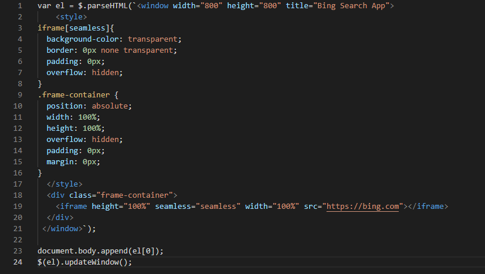
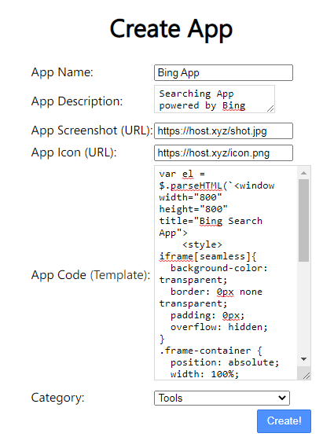

# RebornXP Developer's Guide

<br><br>Guide for developers on publishing their web app to the RebornXP Appstore

# Introduction
This guide contains the rules & template for creating a RebornXP supported program. Edit the template <a href="appname.js">(appname.js)</a> in such way that you are able to resize the app window, app title, app link for example:<br><br>

``` 
var el = $.parseHTML(`<window width="800" height="500" title="Your App's title">
   <!--Adjust the window title and size according to your web app-->
    
    <style>
iframe[seamless]{
  background-color: transparent;
  border: 0px none transparent;
  padding: 0px;
  overflow: hidden;
}
.frame-container {
  position: absolute;
  width: 100%;
  height: 100%;
  overflow: hidden;
  padding: 0px;
  margin: 0px;
}
  </style>
  
  <div class="frame-container">
    
<iframe height="100%" seamless="seamless" width="100%" src="https://www.helloworld.org"></iframe>
<!--Make sure your site has anti-framing disabled or your app will show a blank screen!-->

  </div> 
 </window>`);
    
document.body.append(el[0]);
$(el).updateWindow(); 
```
<br><br>
Such as this code compiles a Microsoft Bing Search App:<br><br>

<br><br>
After you are done with modification to appname.js, copy the code (don't fork or send pull requests) and navigate to <a href="https://xpstore.glitch.me/createapp">RebornXP Developer's Panel</a> and fill in the details, and click "Create!" button:<br><br>

<br><br>
And you have successfully published your app to the RebornXP AppStore.
<h2 id="dev-policy">
Developer Policy
</h2>

## 1. Restricted Content
Before submitting an app to Store, ensure it complies with these content policies and with local laws. 
- Should not contain inappropriate content
- App must not link with any real money gambling
- No unapproved substances
- No child endangerment
- No Spam to the AppStore
## 2. Impersonation
When developers impersonate others or their apps, it misleads users and hurts the developer community. We prohibit apps that mislead users by impersonating someone else.
## 3. Intellectual Property
When developers copy someone else's work or deceive users, it hurts users and the developer community. Don't rely on misleading or unfair use of other people's work.
## 4. Malware
Malware is any code that could put a user, a user's data, or a device at risk. Because Malware is potentially harmful to users, apps containing Malware are strictly prohibited from Appstore.
## 5. Families
Before submitting an app that targets children to the Store, you are responsible for ensuring your app is appropriate for children and compliant with all relevant laws.
